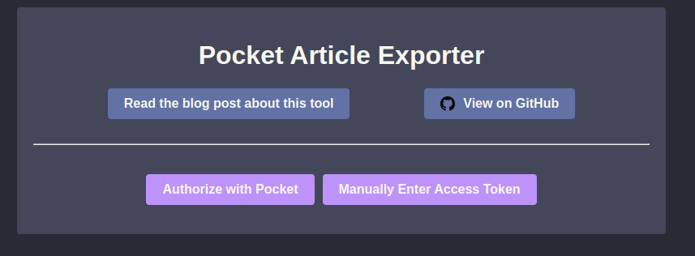

## What is this?

TBD

## Pre-requisites

The app uses the following environment variables:

| Variable Name         | Description                                                                                                                                                                                                                                                   |
| --------------------- | ------------------------------------------------------------------------------------------------------------------------------------------------------------------------------------------------------------------------------------------------------------- |
| `POCKET_CONSUMER_KEY` | _Required_. Your Pocket API consumer key. Instructions on setting one up can be found [here](https://getpocket.com/developer/docs/authentication).                                                                                                            |
| `POCKET_REDIRECT_URI` | _Optional_. The URL that the Pocket API should redirect to during the authorization flow. If you can host the app with a publicly available URL (maybe through ngrok), set this to that URL. If not, you can leave this blank and manually authorize the app. |

## Running the app locally

### Via Docker

```bash
 docker run --rm --name pocket_article_exporter -e POCKET_CONSUMER_KEY -e POCKET_REDIRECT_URI -p 8999:8999 ghcr.io/ryderstorm/pocket_article_exporter:main
```

### Locally via Ruby

```bash
bundle install
./bin/start.sh
```

Once you have the app up and running, visit http://localhost:8999 and you should see the main page of the app:



To see more logging for debugging, run the app with the `LOG_LEVEL` environment variable set to `DEBUG`.

## References

- https://getpocket.com/developer/docs/getstarted/web
- https://getpocket.com/developer/docs/authentication

```

```
